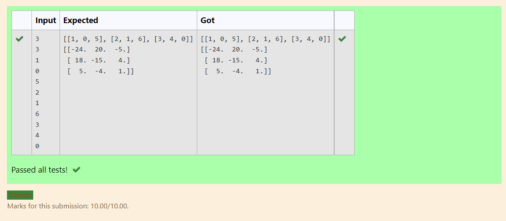

# Inverse-of-matrix

### AIM:
To write a python program for Inverse of matrix

### ALGORITHM:
### Step 1:
Import numpy as np

### Step 2:
Enter the input.

### Step 3:
Use for loop and range.

### Step 4:
Use np.linalg.inv() to find inver of a matrix.

### Step 5:
Print()

## PROGRAM:
```import numpy
rows=int(input())
columns=int(input())
l1=[]
for i in range(rows):
    temp=[]
    for j in range(columns):
        t=int(input())
        temp+=[t]
    l1+=[temp]
print(l1)
print(numpy.linalg.inv(l1))
```

## OUTPUT:


## RESULT:
Thus the program is written to find the matrix.
